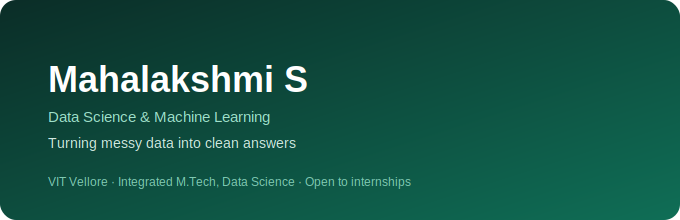

<picture>
  <source media="(prefers-color-scheme: dark)" srcset="hero-dark.svg">
  
</picture>

 

## About Me

I'm Mahalakshmi — a Data Science student at VIT Vellore who learns best by building, not by following along. Give me a dataset or a problem and I'll usually end up with a working prototype before I'm done overthinking it.

My core tools are Python, SQL, and Tableau, with some detours into blockchain just to understand how systems outside the usual data stack are built. Right now I'm sharpening SQL and applied ML, with Power BI and Generative AI next on the list — and I'm looking for a Data Science internship where curiosity like this is actually useful.

 

## 🚀 Projects

<table>
<tr>
<td width="100%">

#### ⚖️ JusticeChain
Restricts legal record access by role — police, lawyers, judges, citizens — with every change kept on an immutable, publicly auditable chain.

[**View Repository →**](https://github.com/mahasekar126/justice-chain-)

</td>
</tr>
</table>

<table>
<tr>
<td width="100%">

#### 🎬 StreamNest
Netflix-style streaming platform with real authentication and cloud-hosted video delivery — not a static front-end mockup.

[**View Repository →**](https://github.com/mahasekar126/streamnest)

</td>
</tr>
</table>

<table>
<tr>
<td width="100%">

#### 📊 Global Superstore Sales Intelligence
Tableau dashboard surfacing where global retail profit is won or lost, by region and category.

[**View Repository →**](https://github.com/mahasekar126/Global-Superstore-Sales-Intelligence)

</td>
</tr>
</table>

<table>
<tr>
<td width="100%">

#### 🚲 Smart Bike Safety & Alert System
IoT prototype detecting missing-helmet and accident conditions, pushing automated alerts in real time.

*Private repository — ask to view*

</td>
</tr>
</table>

<table>
<tr>
<td width="100%">

#### ⚡ Intelligent Case Prioritization System
Fuzzy-logic engine ranking legal cases by urgency and complexity instead of simple first-in-first-out order.

*Private repository — ask to view*

</td>
</tr>
</table>

 

## 🛠️ Tech Stack

<table>
<tr>
<td valign="top">

**Languages**

**Data Science**

**Backend**

</td>
</tr>
<tr>
<td valign="top">

**Tools**

**Blockchain**

**Cloud**

</td>
</tr>
</table>

 

## 🏆 Certifications

<table>
<tr>
<td width="50%" valign="top">

**Deloitte Australia**
Data Analytics Job Simulation

</td>
<td width="50%" valign="top">

**J.P. Morgan**
Quantitative Research Virtual Experience

</td>
</tr>
</table>

 

## 🎯 Current Focus

<table>
<tr>
<td align="center" width="33%">

📖 **Learning**
 
Advanced SQL

</td>
<td align="center" width="33%">

🎯 **Goal**
 
Data Science Internship

</td>
<td align="center" width="33%">

🚀 **Next**
 
Power BI · Gen AI

</td>
</tr>
</table>

 

## 📊 GitHub Stats

 

---

**Let's connect**

[Email](mailto:mahasekar126@gmail.com) &nbsp;·&nbsp; [LinkedIn](https://www.linkedin.com/in/mahalakshmi-s-75665728b/) &nbsp;·&nbsp; [GitHub](https://github.com/mahasekar126)

