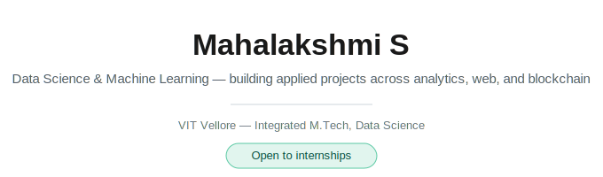

<picture>
  <source media="(prefers-color-scheme: dark)" srcset="header-dark.svg">
  
</picture>

 

I build end-to-end data and software systems — from a Tableau sales dashboard to a blockchain-based legal records platform — rather than isolated tutorial exercises.

 

## Featured Projects

| Project | Impact | Tech | Link |
|:--|:--|:--|:--:|
| **JusticeChain** | Restricts legal record access by role (police, lawyers, judges, citizens) with every change kept on an immutable, publicly auditable chain | `Solidity` `Hardhat` `Web3` | [Repo →](https://github.com/mahasekar126/justice-chain-) |
| **StreamNest** | Netflix-style streaming platform with real authentication and cloud-hosted video delivery — not a static front-end mockup | `Flask` `SQL` `Cloudinary` | [Repo →](https://github.com/mahasekar126/streamnest) |
| **Global Superstore Sales Intelligence** | Tableau dashboard surfacing where global retail profit is won or lost, by region and category | `Tableau` `EDA` | [Repo →](https://github.com/mahasekar126/Global-Superstore-Sales-Intelligence) |
| **Smart Bike Safety & Alert System** | IoT prototype detecting missing-helmet and accident conditions, pushing automated alerts in real time | `IoT` `Sensors` | *Private — ask to view* |
| **Intelligent Case Prioritization System** | Fuzzy-logic engine ranking legal cases by urgency and complexity instead of simple first-in-first-out order | `Python` `Fuzzy Logic` | *Private — ask to view* |

 

## Skills

<table>
<tr>
<td valign="top" width="50%">

**Languages**
Python · SQL · Java · C · C++

**Data Science**
Pandas · NumPy · Scikit-learn · Matplotlib · EDA · Feature Engineering

**Backend**
Flask · MySQL

</td>
<td valign="top" width="50%">

**Tools**
Git · GitHub · Tableau · Excel · Jupyter

**Blockchain**
Solidity · Hardhat · Web3 · MetaMask · Sepolia

**Cloud**
Render · Cloudinary

</td>
</tr>
</table>

 

## Certifications

<table>
<tr>
<td width="50%">

**Deloitte Australia**
Data Analytics Job Simulation

</td>
<td width="50%">

**J.P. Morgan**
Quantitative Research Virtual Experience

</td>
</tr>
</table>

 

## Current Focus

| Status | Topic |
|:--|:--|
| Learning now | Advanced SQL |
| Next up | Power BI · Generative AI · Prompt Engineering · RAG |

 

---

📧 [Email](mailto:mahasekar126@gmail.com) &nbsp;·&nbsp; 💼 [LinkedIn](https://www.linkedin.com/in/mahalakshmi-s-75665728b/) &nbsp;·&nbsp; 🧑‍💻 [GitHub](https://github.com/mahasekar126)

